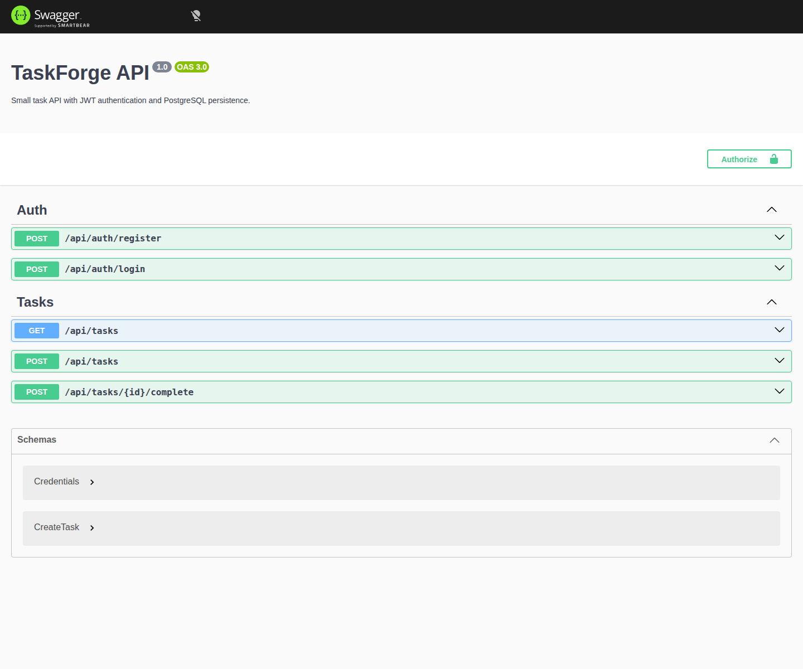

# TaskForge API

A small task-management API built with NestJS, Prisma and PostgreSQL.

I use it as the backend for two frontend applications: WorkBoard (Vue) and ClientHub (React). The API stays focused on authentication, validation, ownership and persistence.

## Stack

- NestJS + TypeScript
- PostgreSQL + Prisma
- JWT authentication
- bcrypt password hashing
- class-validator
- Swagger/OpenAPI
- Jest
- Docker Compose
- GitHub Actions

## API

| Method | Endpoint | Purpose |
| --- | --- | --- |
| POST | `/api/auth/register` | Create an account |
| POST | `/api/auth/login` | Sign in |
| GET | `/api/tasks` | Get the signed-in user's tasks |
| POST | `/api/tasks` | Create a task |
| POST | `/api/tasks/:id/complete` | Complete a task |

Tasks are scoped to the authenticated user on the server. The user ID comes from the JWT rather than from a client-supplied ID, so one account cannot read or modify another account's tasks.

## Run locally

```bash
docker compose up -d postgres
cp .env.example .env
npm install
npm run prisma:generate
npx prisma migrate deploy
npm run start:dev
```

Swagger: `http://localhost:3000/docs`

## Project structure

```
src/
  auth/        authentication and JWT handling
  tasks/       task endpoints and business logic
  prisma/      database access
```

CI runs the tests, type-check, Prisma migration and production build. It also starts the API and captures the Swagger page with Playwright.


